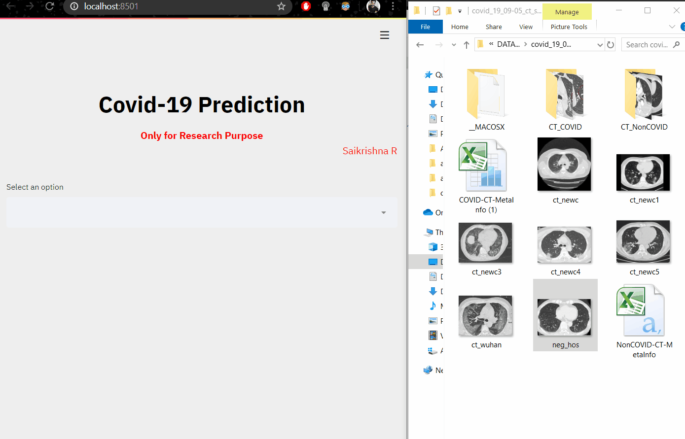

<h1 align="center">Covid 19 Detection using CT-scans</h1>

*This project is for research purpose and <b>not for Real life medical usage.
</b>

  <a href="#overview">Overview</a>•<a href="#Results"> Results</a>•<a href="#Requirements"> Requirements</a>•<a href="#Usage"> Usage</a>•<a href="#Acknowledgements"> Acknowledgements</a>

# Overview
<b>There has been a huge argument going on about whether to use CT- scans for diagnosing Covid_19. According to the author Tao Ai et al. (2020) - <i>" Chest CT imaging has high sensitivity for diagnosis of COVID-19. Our data and analysis suggest that chest CT should be considered for the COVID-19 screening, comprehensive evaluation, and following-up, especially in epidemic areas with high pre-test probability for disease."</i>Although Ct scans are easy to perform and get analysis, they are costly in some cases. Rapid test done for covid 19 are mostly false postive or false negative, where both leads to terrible situation. </b>
 
- <b>Data</b>: Here i have considered CT - scans for detecting Covid_19. Data source is from https://github.com/UCSD-AI4H/COVID-CT
 
- <b>Modeling:</b> This data set has low number of Ct scans of patients, so the optimal way to model was using Data Augmentation and training with pretrained model.Transfer learning can be used to boost accuracy if our labeled images are less in number. I have tried transfer learning using the following pre- trained models - VGG16, ResNet50, Resnet101v2, Xception and Densenet169.
 

# Results
I have built this app using Streamlit. Streamlit is the fastest way to build Machine learning and deep learning models.

# Requirements 
The main requirements are listed below:
* Keras
* Streamlit
* Python 3.7
* Numpy
* OpenCV

# Usage
- Install Streamlit.
- Within the COVID_19-Detection directory run the following: streamlit run Covid_19.py. This should automatically open a browser window with the user interface.
- Try using different images of CT scans from different corona patients. If there is an error, please raise an issue.
# Segmentation
<b>Still in Progress</b>
# Acknowledgements
- Correlation of Chest CT and RT-PCR Testing in Coronavirus Disease 2019 (COVID-19) in China: A Report of 1014 Cases.  - https://pubs.rsna.org/doi/10.1148/radiol.2020200642
